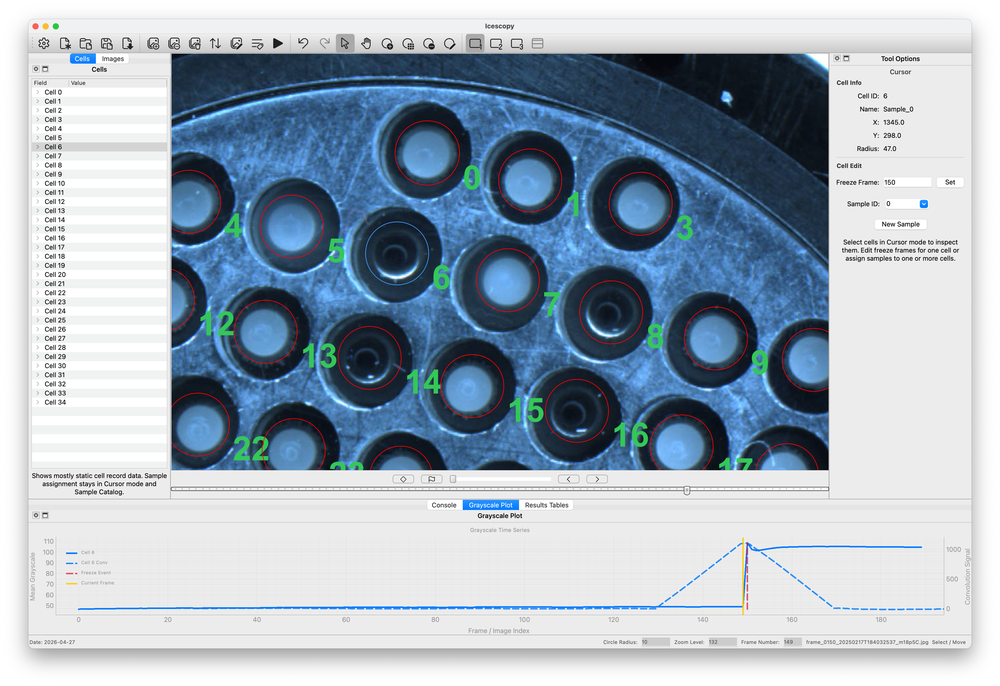
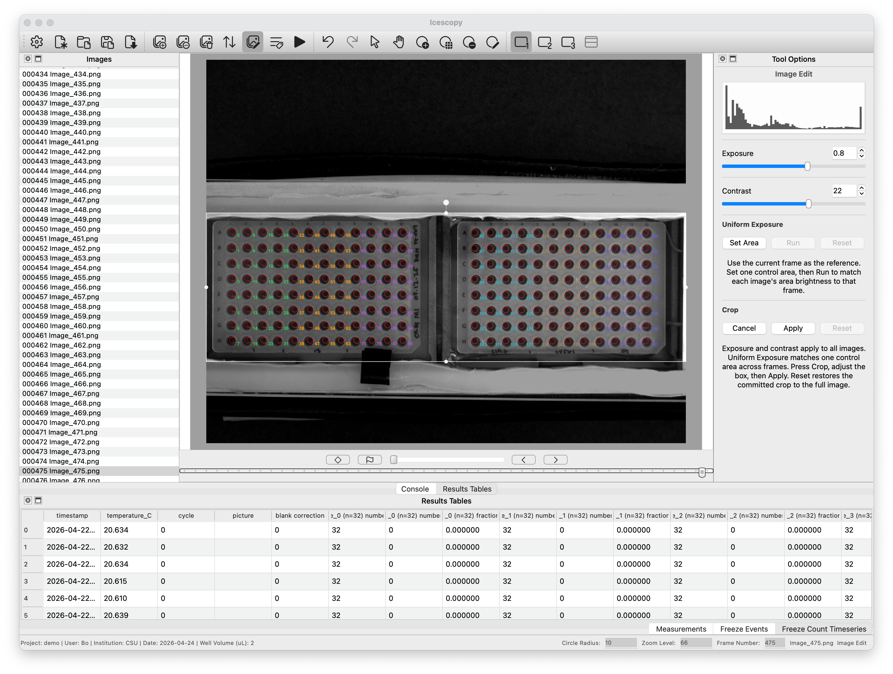
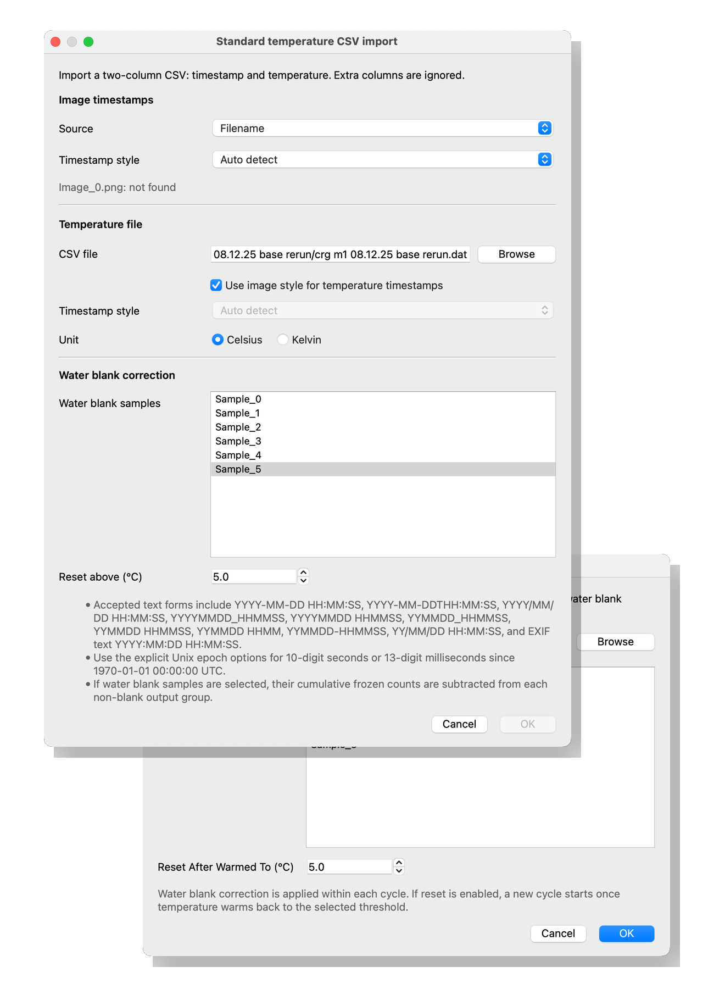
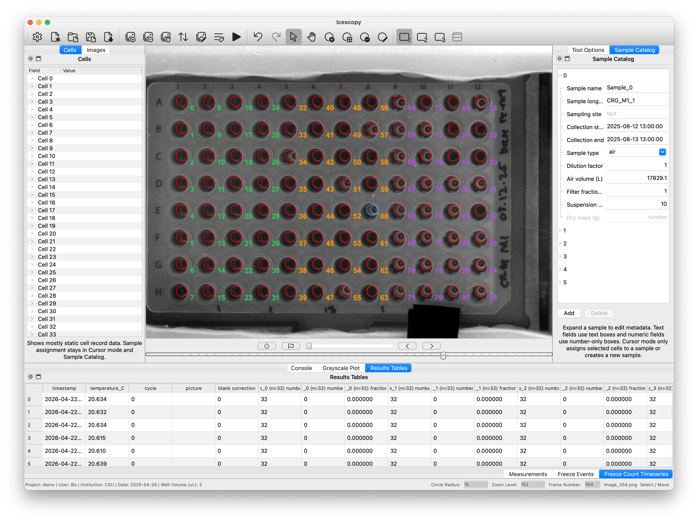

# Icescopy

Icescopy is a desktop application for ice assay image data. It supports droplet arrays, multiwell plates, and other image-based freezing assays by combining image annotation, sample metadata, grayscale timeseries review, freeze-event detection, and temperature-linked freeze count export in one session.

## Citation

If you use Icescopy in your work, please cite it as:

Chen, B. (2026). *Icescopy* (Version 2.0.0) [Computer software]. Zenodo. https://doi.org/10.5281/zenodo.19673845

## Workflow Highlights

Icescopy is designed for flexible ice assay workflows where every droplet or well needs to stay traceable from raw image review through final result export. It does not assume one fixed plate layout or one fixed experiment style: users can annotate the assay geometry that appears in their images, attach sample information, and review the resulting freeze counts and timeseries inside the same workspace.

### Annotate Freezing Arrays Directly

Use single-cell and grid tools to mark droplets, wells, or other assay locations directly on the image data. For each annotated location, Icescopy lets you view the grayscale timeseries and inspect the frozen frame result from its robust grayscale-based freeze finding algorithm. Visible location numbers keep manual review, freezing calls, and exported results tied to the same physical locations.

### Prepare Image Sequences Before Analysis

Image assay data often needs cleanup before freezing events can be reviewed reliably. Icescopy can adjust exposure and contrast, crop the field of view, and apply uniform exposure normalization so brightness is matched across frames before grayscale-based analysis.

### Import Temperature Timeseries Or Customize The Workflow

Import a standard temperature timeseries file, use instrument-specific importers, or customize how image timestamps should be matched to temperature records. Icescopy can apply water blank correction and can also help correct or double-check an instrument's real-time frozen counts against image-derived freeze calls.

### Enter Sample Metadata And Review Results

After annotation, use the sample catalog to enter sample names, collection information, sample type, dilution, volumes, and related metadata. Icescopy then keeps that metadata beside the image-derived measurements so freeze count timeseries, result tables, and exports remain connected to the samples they came from.

## Notes

- The packaged app does not include the repo `README.md`.
- `.icescopy` session files are zip-based bundles containing the saved session state and result tables.
- Please reach out to me if you have a special temperature file format that needs to be paired with the freezing detection workflow, and I will help incorporate it into Icescopy.
