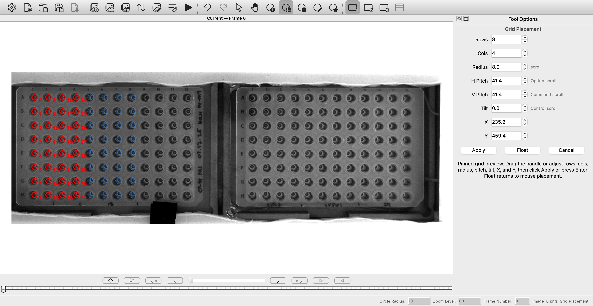
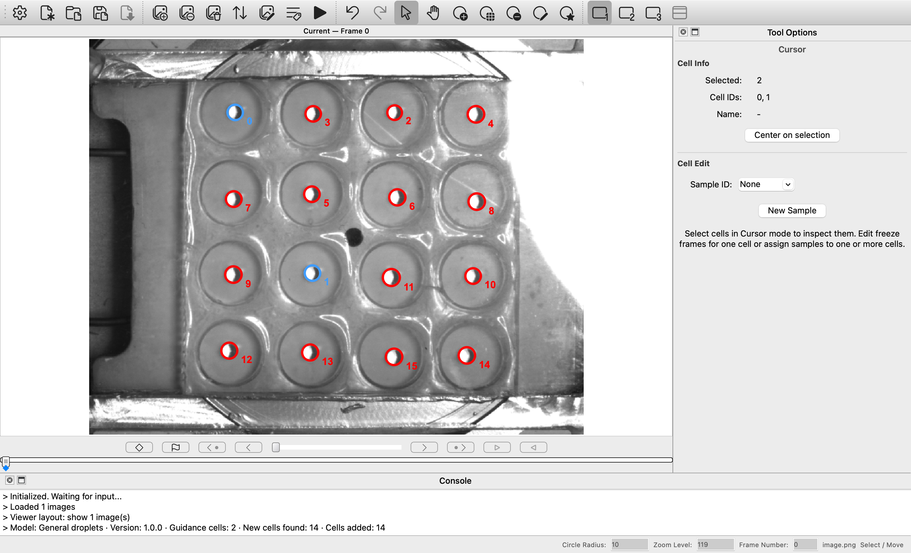
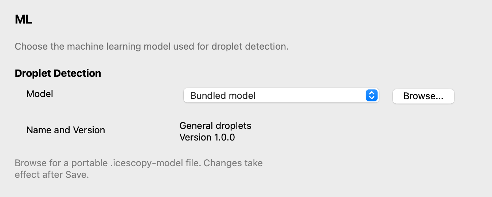
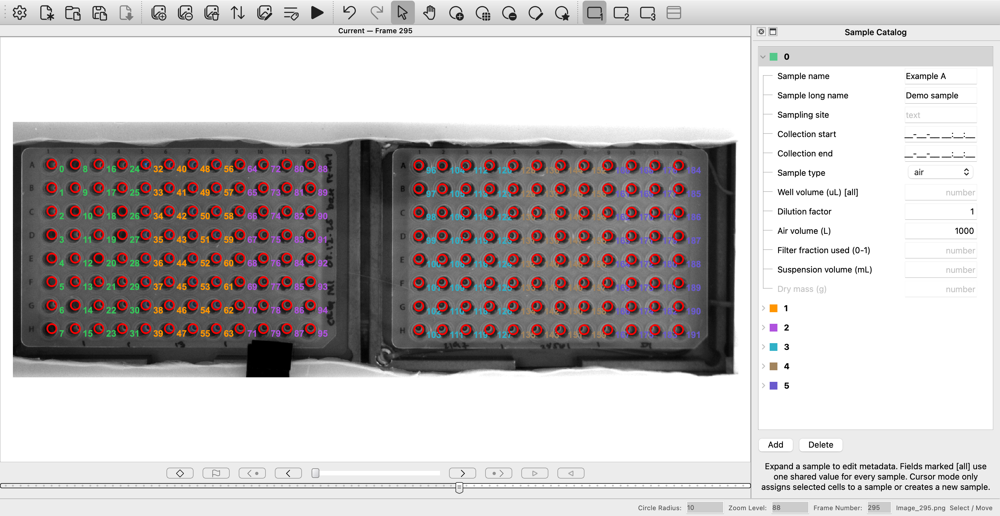
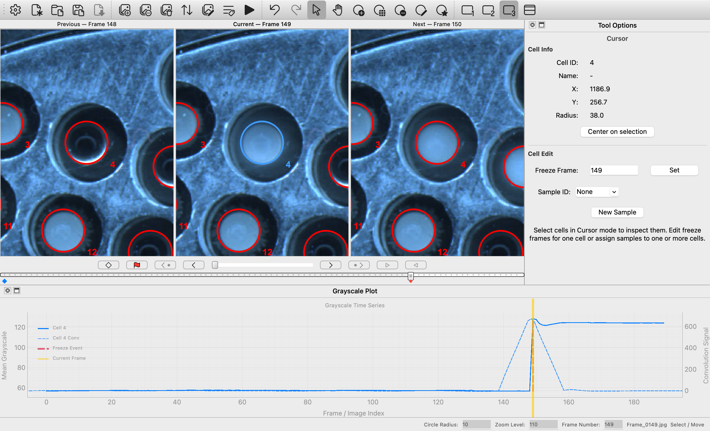
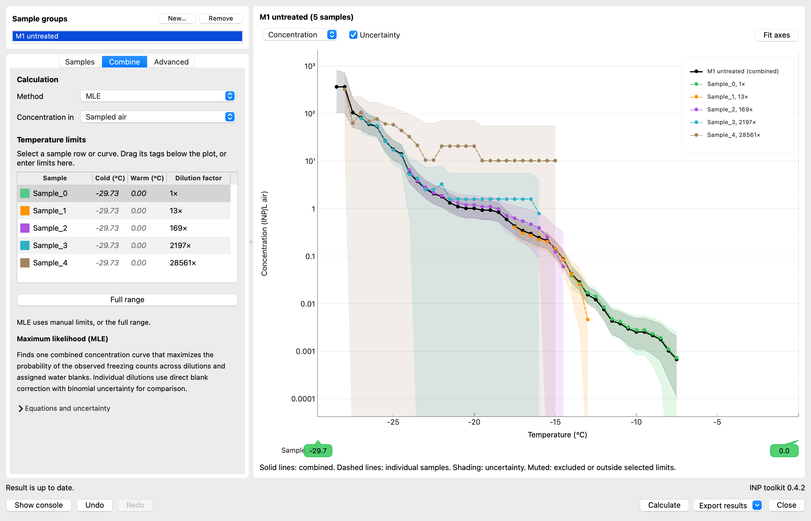

# Icescopy

Icescopy is a desktop app for analyzing images and videos of freezing experiments. Mark droplets or wells, find when they freeze, compare neighboring frames, and match events to temperature records. Experimental droplet selection can find similar cells from a few marked examples.

For further ice-nucleating particle (INP) concentration calculations, install [**INP-toolkit 0.4.4**](https://github.com/bochens/inptk/releases/tag/v0.4.4) separately and link its executable in **Preferences → INP toolkit client**. This is the matching toolkit release for **Icescopy 2.6.1**.

[Quick start](wiki/Quick-Start.md) | [User guide](wiki/Home.md) | [Releases](https://github.com/bochens/Icescopy/releases)

## Install

Download the version listed for your computer below. These downloads include Python and the required libraries; release notes are on [GitHub Releases](https://github.com/bochens/Icescopy/releases).

| Platform | Download | Installation |
| --- | --- | --- |
| Windows 10 (1809 or later) / 11, x64 | [Icescopy-windows-installer.exe](https://github.com/bochens/Icescopy/releases/download/v2.6.0/Icescopy-windows-installer.exe) — v2.6.0 | Run the installer. |
| macOS, Apple Silicon (M-series) | [Icescopy-macos-arm64.zip](https://github.com/bochens/Icescopy/releases/download/v2.6.1/Icescopy-macos-arm64.zip) — v2.6.1 | Unzip, then move **Icescopy.app** to **Applications**. |

The app files are listed under **Assets**. See [installation help](wiki/Installation-and-Setup.md) for platform requirements and macOS opening instructions.

## Developer setup

With conda installed, clone this repository and run these commands from its folder:

```bash
conda env create -f environment.yml
conda activate icescopy-dev
icescopy
```

See [running from source](wiki/Installation-and-Setup.md#run-from-source) for other environments, checks, and packaging.

## Citation

If you use Icescopy in your research, please cite:

Chen, B. (2026). *Icescopy* (Version 2.0.0) [Computer software]. Zenodo. [doi:10.5281/zenodo.19673845](https://doi.org/10.5281/zenodo.19673845)

For help, bug reports, or requests for another temperature-file format, [open a GitHub issue](https://github.com/bochens/Icescopy/issues).

## From recording to results

Load an image sequence or one or more video clips. Crop the view or adjust exposure and contrast if needed. The [quick start](wiki/Quick-Start.md) walks through the controls for the workflow below.

### 1. Mark droplets or wells

A **cell** is the circle whose brightness Icescopy measures. Draw cells with **Add Cell**, or use **Grid Tool** to place a regular array.



*Colorado State University (CSU), Ice Spectrometer setup. Red circles are placed cells; the blue grid previews the next group.*

**Experimental droplet detection** uses a neural network built on **MobileNetV3-Small, pretrained on ImageNet**, then trained to find droplets using marked examples. Mark and select a few representative droplets, then click the **star tool** beside **Edit Cell**. **Detect Droplets (Current Frame)** finds similar droplets in the current image or video frame and adds new cells without duplicating existing ones. Review the circles, edit any mistakes, or undo the batch.



*Texas A&M University (TAMU), droplet stage. In this example, the two blue circles are selected guidance examples, and the fourteen red circles were added automatically. (Automatic and manually drawn cells use the same red outlines in the application.) The Console shows the model version and counts.*

The app includes **General droplets 1.0.0**, which runs on the CPU without a GPU or training software. In **Preferences → ML**, choose the bundled model or use **Browse…** to load compatible custom weights packaged as a `.icescopy-model` file.



To improve automatic selection for your instrument and lighting, you can **continue training the supplied model or train your own compatible model**. The [training notebook](auto_cell_ml/train_and_evaluate.ipynb) covers training, evaluation, and exporting weights for the app; the [machine learning module](auto_cell_ml/README.md) includes labeled examples, synthetic scenes, and trainable weights. Load the new model without updating Icescopy, and check its results before running freezing analysis.

If droplets or the image shift during a recording, cell circles may no longer line up with the droplets in later frames. Add **keyframes** at those frames and correct the cell positions; Icescopy adjusts the cells between keyframes. See [drawing and editing cells](wiki/Annotation-Workflow.md) and [droplet detection](wiki/Droplet-Detection.md).

### 2. Assign samples

Assign selected cells to a **Sample ID** in **Tool Options**, then enter details such as dilution and well volume in **Sample Catalog Manager**. Add your own sample fields, choose which appear in exports, or share a value across all samples.



*Colorado State University (CSU), Ice Spectrometer setup. Label colors distinguish sample groups; the sample details shown are illustrative.*

### 3. Automatically detect freeze frames

Icescopy finds likely freeze frames by tracking each cell’s average brightness over time. It uses **convolution**, a sliding comparison of nearby brightness values, to highlight changes that may indicate freezing. It then checks the original measurements to locate the freeze frame.

Analyze the whole recording, or use the timeline’s **analysis start and end markers** to select one or more intervals and exclude setup, warming, or other unwanted frames.

Choose **Analysis → Run Analysis** to start. Rerun analysis if you change the analysis intervals or cells. See [setting analysis limits](wiki/Analysis-and-Results.md#limit-analysis-with-start-and-end-markers) for details.

### 4. Review and refine freezing

Select a cell to see its **Grayscale Plot**, which shows brightness over time. **Show Two Images** or **Show Three Images** displays neighboring frames in separate panes, with each frame’s cell positions and sizes. Pan or zoom in any pane to compare the same area across frames. Select or edit cells in the **Current** pane.



*Peking University (PKU), cold stage. Linked views show the same droplet before, during, and after freezing, with its brightness plot below.*

For missed or incorrect detections, open **Preferences → Analysis → Freeze Finding**:

- Enable **Detect freezing from brightening** if freezing makes cells brighter; leave it off if they become darker.
- Lower **Peak Prominence** to find weaker changes; raise it to reject small false detections.
- Increase **Peak Width** to reject brief noise; lower it if a real, narrow response is missed.

Prominence and width apply to the dashed line, which highlights changes in brightness. Change one setting at a time, save preferences, and rerun analysis. Check cells with clear, weak, and no freeze events. See the [full tuning guide](wiki/Analysis-and-Results.md#review-and-tune-freeze-detection) for the remaining controls and troubleshooting.

You can also **modify individual freeze events**. Select a cell and edit **Freeze Frame** in **Tool Options**, or use the timeline flag to add or remove an event at the current frame. Make manual corrections **after tuning**: rerunning analysis replaces them.

### 5. Add temperature and export

Use **Analysis → Import Temperature Data** to match freeze events with CSV or supported instrument records. Repeated cooling cycles are supported. All samples, including blanks, retain their own total and frozen counts; blank correction belongs in downstream analysis. See [supported temperature imports](wiki/Temperature-Import.md).

Save a `.icescopy` session to resume later. **File → Output Results** exports brightness measurements, freeze events, or temperature-based counts with sample information. Keep the original images or videos: the session refers to them.

Use **Save Session As...** and a new export folder to preserve earlier work. See [saving and exporting](wiki/Sessions-Export-and-Preferences.md).

### 6. Calculate INP concentrations

The **INP toolkit client** sends Icescopy's Freeze Count Timeseries to [INP toolkit (`inptk`)](https://github.com/bochens/inptk) to calculate temperature-dependent **ice-nucleating particle (INP) concentrations** and uncertainty. Install the toolkit separately; Icescopy runs its command-line executable as a separate process.

Choose the executable in **Preferences → INP toolkit client**, test the connection, and save. Then open **Analysis → INP Analysis…** to load the current counts automatically. Group samples or dilutions, select water controls marked **water blank** in the catalog, and enable blank correction. Choose **MLE (maximum likelihood estimation)** or **Average**, and select concentration in suspension, sampled air, or dry soil using the corresponding sample metadata.

Compare **number frozen**, **fraction frozen**, and **concentration** in the interactive plot. Concentration shows the combined group in black alongside directly calculated, blank-corrected dilution curves in their sample colors. Individual uncertainty comes from sample and blank binomial counts, regardless of the combination method. Set each dilution's temperature limits by dragging its tags below the plot or typing values; **Calculate** applies changes. **Auto range** can suggest limits for Average.



*Example of MLE analysis with the INP toolkit client.*

Save the `.icescopy` session to retain analysis choices and results. Export combined groups and individual sample concentrations as separate CSVs, each with temperature rows and concentration, lower-bound, and upper-bound columns; the default calculation grid is 0 to −35 °C in 0.5 °C steps. Save a native `.inptk` session to retain the full toolkit result and uncertainty. See the [INP analysis guide](wiki/INP-Analysis.md) for grouping, blank correction, temperature limits, and exports, and the [INP toolkit repository](https://github.com/bochens/inptk) for installation and calculation details.
