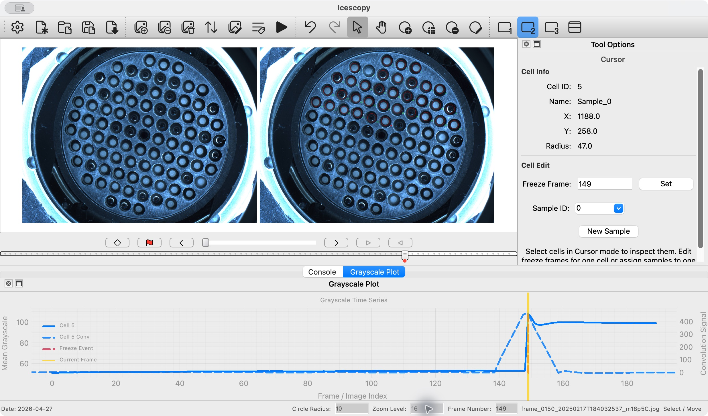
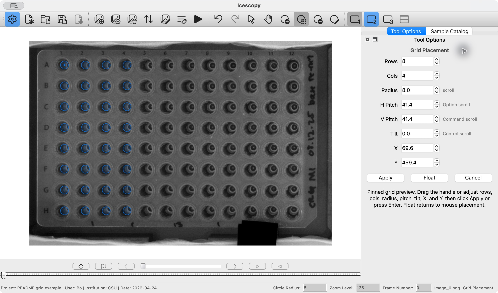
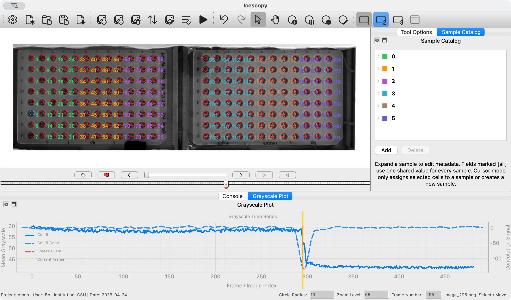

# Icescopy

Icescopy is a desktop application for reviewing image sequences and videos of freezing assays. Annotate droplets or wells, inspect their brightness over time, review freezing events, and combine those events with temperature records and sample information.

It supports flexible droplet arrangements and multiwell plates, with tools for drawing individual cells or grids, comparing frames, correcting freeze events, and exporting results for further analysis.

[Installation and setup](wiki/Installation-and-Setup.md) · [Quick start](wiki/Quick-Start.md) · [User guide](wiki/Home.md)

## A Typical Workflow

1. Start with **File → New Session**, then add image files, an image folder, or a video source.
2. Use **Add Cell** or **Grid Tool** to mark droplets or wells. Assign cells to samples and enter sample information.
3. Check the frame order and image adjustments. Set analysis start and end markers on the timeline if only part of the recording should be measured.
4. Choose **Analysis → Run Analysis**, inspect the grayscale plot, and review or correct the detected freeze frames.
5. Import the matching temperature record, review the sample counts, then save the session and export the required CSV tables.

## Workflow Examples

### Compare Frames And Review Freezing

Use the **Show Two Images** or **Show Three Images** toolbar controls to compare nearby frames. Select a numbered cell to inspect its grayscale plot, which shows how its average brightness changes through the recording. The current-frame marker helps connect a change in the plot to the corresponding image.



The timeline flag button marks or clears a freeze event for the selected cells at the current frame. Detection settings also support freezing that appears as **brightening** instead of darkening. Review the images before accepting or changing an event.

### Draw An Array To Match The Image

1. Press **G** for **Grid Tool**, move the preview over the wells, and click once to hold it in place.
2. Adjust **Rows**, **Cols**, and **Radius**. **H Pitch** and **V Pitch** set the horizontal and vertical distance between circle centers; **Tilt** rotates the grid. Adjust **X** and **Y**, or drag the handle, to move it.
3. Click **Apply** or press **Enter** to add the cells. The example uses eight rows and four columns, creating 32 cells.

Press **S** to add individual cells, or **A** to return to the cursor and select existing cells. Cell numbers keep annotations connected to their measurements and freeze events.



The grid above demonstrates annotation. Check the placement of each circle before using it for measurements. **Image Edit** provides crop, exposure, contrast, and uniform exposure controls for preparing the images before analysis.

### Keep Wells Connected To Their Samples

**Edit → Sample Catalog Manager** keeps sample names, collection information, dilution, and volumes alongside the measurements. Selecting a cell allows its brightness history to be reviewed in the same workspace.



In **Preferences → Samples**, customize the sample fields, their order, and which fields are included in exports. Fields marked **[all]** share one value across every sample; editing that value updates the whole catalog. Well volume is shared by default.

## Video And Temperature Support

**File → Open Video Source...** opens one video or several clips as a continuous frame sequence, initially ordered by natural filename. Supported file selections include MP4, MOV, AVI, MKV, and M4V; decoding depends on the installed video support. Use the same annotation, grayscale review, analysis markers, and freeze correction tools as for images. A session uses either image files or video clips.

**Analysis → Import Temperature Data** connects freezing events with temperature records from CSV files or supported instruments. Options include water blank correction and repeated cooling cycles. See the [temperature import guide](wiki/Temperature-Import.md) for supported formats and setup.

## Save, Resume, And Export

- **File → Save Session As...** creates a separate `.icescopy` file for a new analysis or example. Sessions preserve annotations, sample information, settings, and result tables. They refer to the original image or video files, so keep those source files available; use **Relink Images Folder...** when an image folder moves.
- **File → Output Results** lets you choose **Grayscale Measurements CSV**, **Freeze Events CSV**, and **Freeze Count Timeseries CSV**. Export to a new folder when preserving earlier results.
- Freeze-count exports include sample information and **number total** and **number frozen** columns for each sample. Calculate the fraction frozen from those counts in downstream analysis. Missing sample information is written as `nan`.

See [Sessions, export, and preferences](wiki/Sessions-Export-and-Preferences.md) and [Analysis and results](wiki/Analysis-and-Results.md) for more detail.

## Developer Setup

The repository includes a Python dependency manifest (`pyproject.toml`) and a conda environment definition (`environment.yml`). From the repository root:

```bash
conda env create -f environment.yml
conda activate icescopy-dev
icescopy-validate
python run_tests.py
icescopy
```

For an existing Python 3.11 environment, install the editable development package with `python -m pip install -e ".[dev]"`. See [Installation and Setup](wiki/Installation-and-Setup.md) for the full validation and packaging workflow.

## Citation

If you use Icescopy in your work, please cite it as:

Chen, B. (2026). *Icescopy* (Version 2.0.0) [Computer software]. Zenodo. [https://doi.org/10.5281/zenodo.19673845](https://doi.org/10.5281/zenodo.19673845)

If your temperature file format or instrument workflow is not supported, please open a GitHub issue or contact me.
