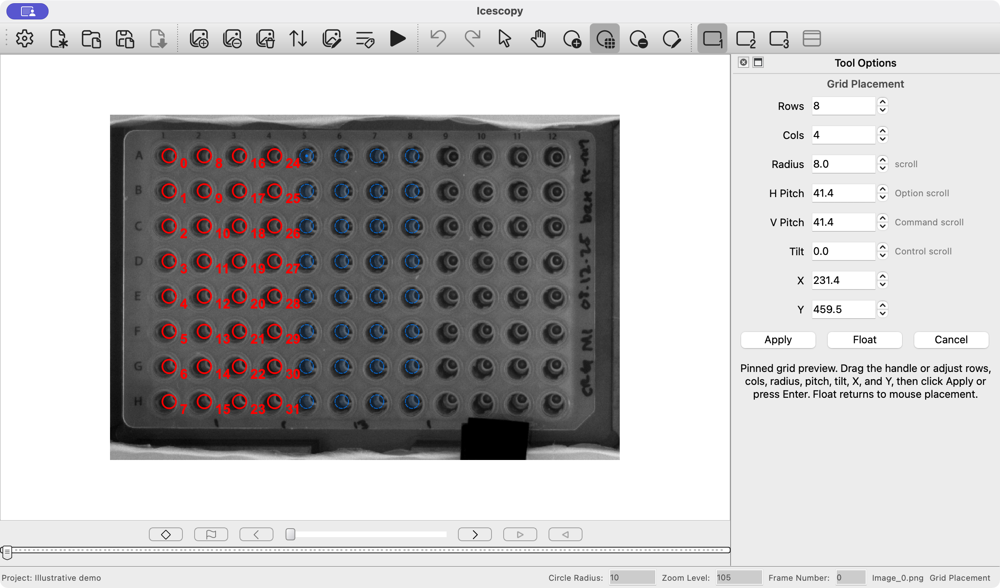
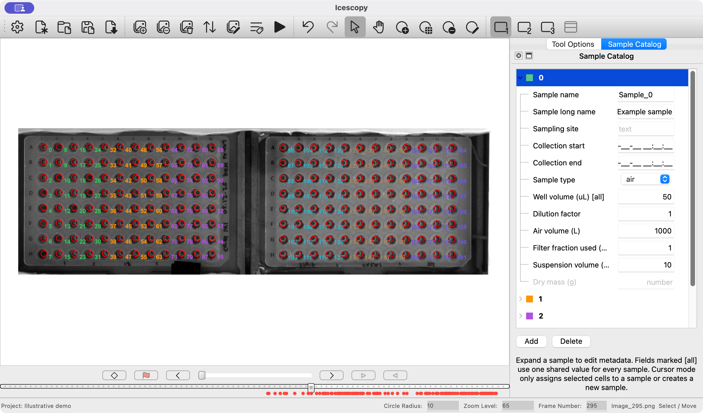
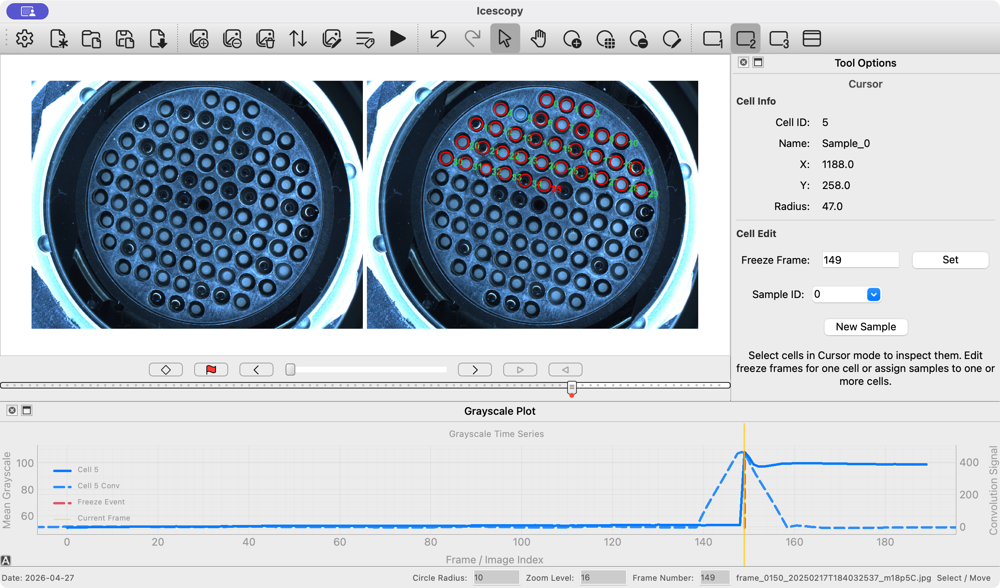

# Icescopy

Icescopy is a desktop app for analyzing images and videos of freezing experiments. Mark droplets or wells, find when they freeze, check the detections against the images, and match them to temperature records.

[Quick start](wiki/Quick-Start.md) · [User guide](wiki/Home.md) · [Releases](https://github.com/bochens/Icescopy/releases)

## Install

Download the version listed for your computer below. These downloads include Python and the required libraries; release notes are on [GitHub Releases](https://github.com/bochens/Icescopy/releases).

| Platform | Download | Installation |
| --- | --- | --- |
| Windows 10 (1809 or later) / 11, x64 | [Icescopy-windows-installer.exe](https://github.com/bochens/Icescopy/releases/download/v2.3.8/Icescopy-windows-installer.exe) — v2.3.8 | Run the installer. |
| macOS, Apple Silicon (M-series) | [Icescopy-macos-arm64.zip](https://github.com/bochens/Icescopy/releases/download/v2.4.0/Icescopy-macos-arm64.zip) — v2.4.0 | Unzip, then move **Icescopy.app** to **Applications**. |

The app files are listed under **Assets**. See [installation help](wiki/Installation-and-Setup.md) for platform requirements and macOS opening instructions.

## Developer setup

With conda installed, clone this repository and run these commands from its folder:

```bash
conda env create -f environment.yml
conda activate icescopy-dev
icescopy
```

See [running from source](wiki/Installation-and-Setup.md#run-from-source) for other environments, checks, and packaging.

## Citation

If you use Icescopy in your research, please cite:

Chen, B. (2026). *Icescopy* (Version 2.0.0) [Computer software]. Zenodo. [doi:10.5281/zenodo.19673845](https://doi.org/10.5281/zenodo.19673845)

For help, bug reports, or requests for another temperature-file format, [open a GitHub issue](https://github.com/bochens/Icescopy/issues).

## From recording to results

Load an image sequence or one or more video clips. Crop the view or adjust exposure and contrast if needed. The [quick start](wiki/Quick-Start.md) walks through the controls for the workflow below.

### 1. Mark droplets or wells

Draw individual cells with **Add Cell**, or place a row-and-column array with **Grid Tool**. Adjust the size, spacing, and angle to fit the image. Click **Apply** to create the cells.



A **cell** is the circle whose brightness Icescopy measures. If the image moves, save corrected cell positions at different frames (**keyframes**). See [drawing and editing cells](wiki/Annotation-Workflow.md).

### 2. Assign samples

Assign selected cells to a **Sample ID** in **Tool Options**, then enter details such as dilution and well volume in **Sample Catalog Manager**. Add your own sample fields, choose which appear in exports, or share a value across all samples.



### 3. Automatically detect freeze frames

Icescopy finds likely freeze frames by tracking each cell’s average brightness over time. It uses **convolution**, a sliding comparison of nearby brightness values, to highlight changes that may indicate freezing. It then checks the original measurements to locate the freeze frame.

Analyze the whole recording, or use the timeline’s **analysis start and end markers** to select one or more intervals and exclude setup, warming, or other unwanted frames.

Choose **Analysis → Run Analysis** to start. Rerun analysis if you change the analysis intervals or cells. See [setting analysis limits](wiki/Analysis-and-Results.md#limit-analysis-with-start-and-end-markers) for details.

### 4. Review and refine freezing

Select a cell to see its **Grayscale Plot**, which shows brightness over time. **Show Two Images** or **Show Three Images** displays neighboring frames in separate panes, with each frame’s cell positions and sizes. Pan or zoom in any pane to compare the same area across frames. Select or edit cells in the **Current** pane.



For missed or incorrect detections, open **Preferences → Analysis → Freeze Finding**:

- Enable **Detect freezing from brightening** if freezing makes cells brighter; leave it off if they become darker.
- Lower **Peak Prominence** to find weaker changes; raise it to reject small false detections.
- Increase **Peak Width** to reject brief noise; lower it if a real, narrow response is missed.

Prominence and width apply to the dashed line, which highlights changes in brightness. Change one setting at a time, save preferences, and rerun analysis. Check cells with clear, weak, and no freeze events. See the [full tuning guide](wiki/Analysis-and-Results.md#review-and-tune-freeze-detection) for the remaining controls and troubleshooting.

You can also **modify individual freeze events**. Select a cell and edit **Freeze Frame** in **Tool Options**, or use the timeline flag to add or remove an event at the current frame. Make manual corrections **after tuning**: rerunning analysis replaces them.

### 5. Add temperature and export

Use **Analysis → Import Temperature Data** to match freeze events with CSV or supported instrument records. Options include water blank correction and repeated cooling cycles. See [supported temperature imports](wiki/Temperature-Import.md).

Save a `.icescopy` session to resume later. **File → Output Results** exports brightness measurements, freeze events, or temperature-based counts with sample information. Keep the original images or videos: the session refers to them.

Use **Save Session As...** and a new export folder to preserve earlier work. See [saving and exporting](wiki/Sessions-Export-and-Preferences.md).
