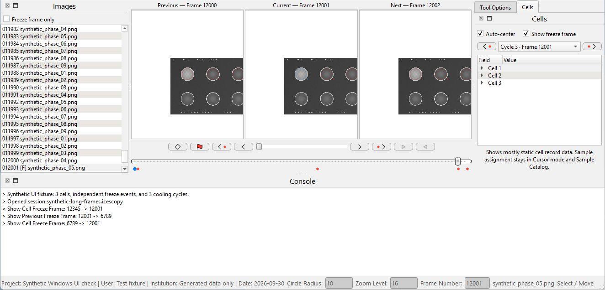
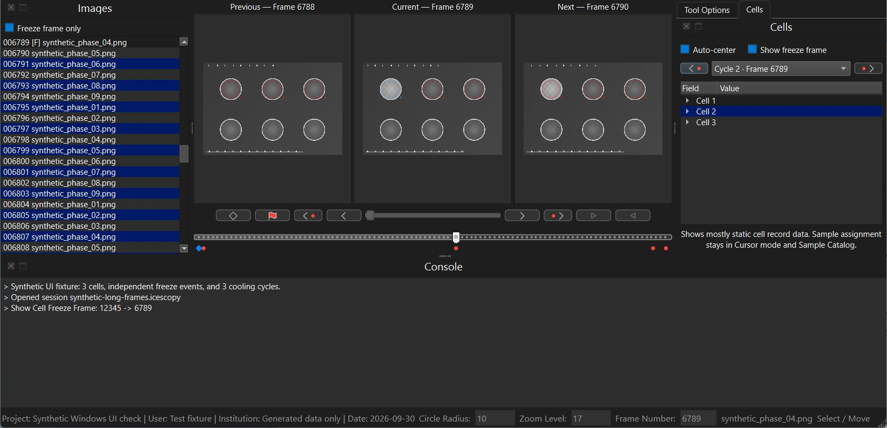
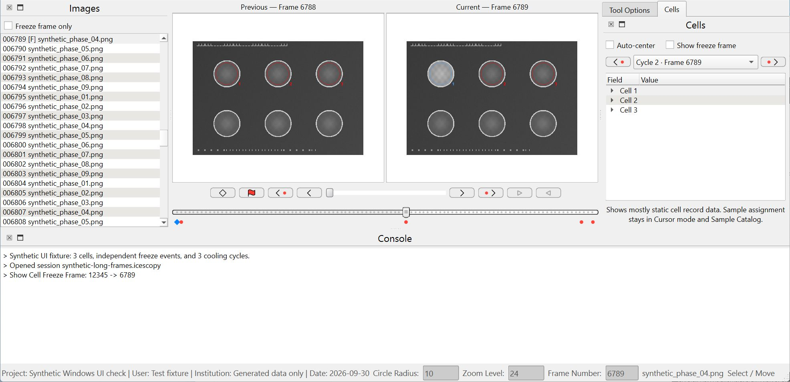
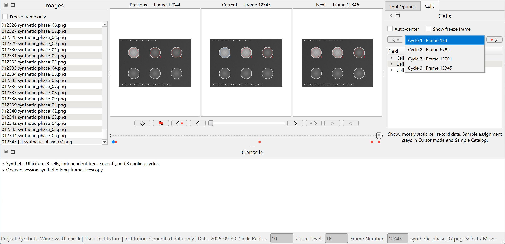

# PR #5 Windows validation — 2026-09-30

Native source and packaged checks passed for the synchronized comparison panels and freeze-event controls. No Windows-specific source adjustment was needed; the shared Mac alignment changes were retained.

Source: `cc52c2273211b33691c8d4d21cf26c48158de466` (`codex/synchronized-image-panels`), app version 2.3.8. Environment: Windows build 26200, Python 3.11.15, Qt 6.11.0, Fusion style. The physical display was 3840 × 2160 with Windows display scaling and text scaling both at 100%; the normal and minimum-readable font resolved to Segoe UI 9 pt.

## Native checks

The percentages below are **Qt process scale factors**. Windows display settings were not changed.

| Run | Theme / process scale | Coverage |
| --- | --- | --- |
| Source, normal `main()` entry point | Light / 100% | One-, two-, and three-panel views; approximately 280–310 logical-pixel Cells dock; navigation and selection states |
| Source, wrapper calling real `main()` with Fusion | Dark forced for this process / 125% | Three-panel captions, checkbox spacing, event-row alignment, open dropdown, keyboard selection and arrow-button focus |
| Packaged executable | Light / 150% | Two-panel view; event navigation from frame 12345 to 6789 preserved zoom 24 |
| Packaged executable | Light / 200% | Three-panel captions; enabled and disabled event buttons; open dropdown with complete cycle/frame labels |

The source 100% run also checked:

- Enabled controls, a cell without events, multiple-cell selection, and Up / Shift+Up selection.
- Explicit Cells event navigation from frame 12345 to 12001 with **Show freeze frame** off.
- Timeline navigation from 12001 to 6789 while retaining the Cells selector's cycle 3 choice; enabling **Show freeze frame** returned to 12001.
- **Auto-center** retained zoom 16 and kept comparison cameras linked.

Checkboxes remained on one line with a visible gap. The Images filter stayed left-aligned. Cells event arrows and dropdown remained together with aligned visible centers, and timeline event buttons stayed in their existing row. Captions and long event labels remained legible.

Light and dark native appearance were reviewed separately; this was not the full theme-by-scale cross-product. Native 420-logical-pixel dock coverage was not recorded. Supplementary **offscreen** Fusion geometry probes covered 280- and 420-logical-pixel docks, both themes, and scale factors 1, 1.25, 1.5, and 2; these measurements supplement the native checks rather than establish native appearance at every combination.

## Screenshots

All screenshots use generated test images and metadata. The title/toolbar region was cropped to remove the parked computer-use pointer; application content below was preserved. All four resulting images were visually inspected with no cursor or private data visible.

## Automated and packaging checks

- 83 existing tests passed: 64 comparison-viewer, 7 toolbar-mode, and 12 freeze-review-cycle tests.
- API documentation consistency passed for 103 pages; wiki link validation passed for 1,028 local links. `git diff --check` passed.
- PyInstaller 6.19.0 built the Windows bundle, and Inno Setup 6.7.3 compiled the installer.
- Packaged `--check-video-dependencies` returned exit 0 and `PyAV import OK` with a Windows-only PATH. Conflicting ICU DLLs were absent.
- PyInstaller reported optional `OpenGL` / `pyqtgraph.opengl`, `jinja2`, and `scipy.special._cdflib` import warnings, plus the ignored macOS AppKit import from `darkdetect`. No Inno compilation warnings were reported.
- The installer was compiled but not installed. This validation did not publish a release or replace an existing installation.

SHA256 of the baseline artifacts used for validation:

| Artifact | Bytes | SHA256 |
| --- | ---: | --- |
| `Icescopy.exe` | 15,855,447 | `e98a5141675b721f5a9218e9f5beb6b382c43c7fdad8b1824d74f98ce2d97e36` |
| `Icescopy-windows-installer.exe` | 136,035,882 | `860cca35861e7c0f83713ccc13294b677e705dc16304de1973fc03ecb62ebd82` |
