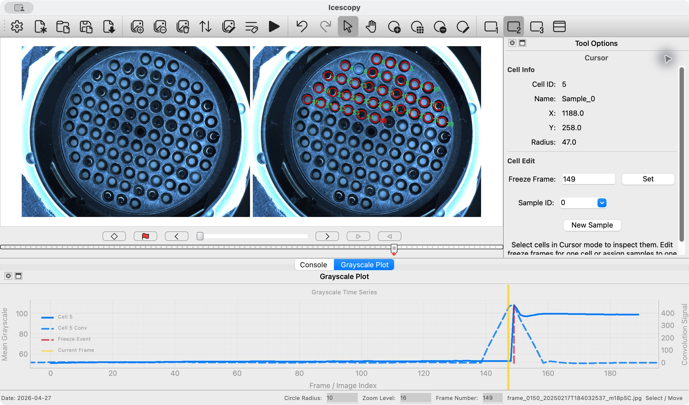

# Annotation Workflow

A cell is a numbered circle marking the part of a droplet or well whose brightness Icescopy measures. Place the circles, check their positions through the recording, assign samples, and then run analysis.

## Choose a tool

Click the image viewer before using a letter shortcut, so you are not typing into a field.

| Key | Tool | Use it to |
| --- | --- | --- |
| **A** | Cursor Tool | Select cells, inspect results, edit freeze frames, and assign samples. |
| **S** | Add Cell | Place an individual circle. |
| **G** | Grid Tool | Place rows and columns of circles. |
| **E** | Edit Cell | Change an existing circle or selected group. |
| **D** | Delete Cells | Remove cells that are no longer needed. |
| **Z** | Pan and Zoom | Move around the image and inspect placement. |

The same tools are available in the **Edit** menu and toolbar.

## Add one cell

1. Press **S** and move the circle preview over a droplet or well.
2. Click once to **pin** the preview: it stops following the pointer, but the cell has not yet been added.
3. Adjust **Radius**, **X**, and **Y** in Tool Options, or drag the preview handle to move it.
4. Click **Apply** or press **Enter** to add the cell. Repeat for other locations.

**Float** makes the preview follow the pointer again. **Cancel** discards the preview. A double-click, or Enter while a preview is following the pointer, pins and applies it in one action.

## Add a grid

1. Press **G**, move the grid over the array, and click once to pin it.
2. Set **Rows**, **Cols**, and **Radius** to match the array and the area to measure inside each well.
3. Adjust **H Pitch** and **V Pitch**: these are the horizontal and vertical distances between neighboring circle centers. **Tilt** rotates the grid.
4. Use **X** and **Y**, or drag the handle, to position the grid. Check the circles at the edges as well as the center.
5. Click **Apply** or press **Enter** to add the cells. Press **A** to inspect the numbered circles afterward.

**Float** returns to pointer placement; **Cancel** discards the preview. A grid only follows the spacing you set, so inspect every circle before measuring.

## Edit existing cells

1. Press **A** and select one cell, or drag a selection box across a group.
2. Press **E**. With no selection, the tool waits for you to choose existing cells.
3. Adjust the preview. A single-cell edit provides radius and position offsets; a group edit also provides spacing and rotation adjustments.
4. Click **Apply** or press **Enter** to accept the edit. Use **Cancel** to leave the original placement unchanged.

Group editing starts from the selected cells' existing arrangement. Editing preserves their cell IDs, which keep the circles connected to their results. To remove a cell instead, use **D**, or select it in Cursor mode and press Delete or Backspace. **Edit → Undo** can undo annotation changes.

## Follow movement with keyframes

A keyframe stores the cell positions and sizes at a particular frame. Icescopy calculates positions and sizes between neighboring keyframes by gradually changing one saved layout into the next.

1. Navigate to a frame where the layout is clear and place the circles.
2. Use the timeline's diamond button to mark that frame as a keyframe.
3. Move to a later frame where the array has shifted. Mark it as a keyframe **before** editing the circles there.
4. Use **E** to align the cells, apply the changes, and inspect intermediate frames.

Once keyframes exist, geometry edits are recorded in the saved layout only when the current frame is a keyframe. Add or select a keyframe before making a lasting alignment correction. Rerun analysis after changing cell geometry or keyframes.

## Compare images and inspect a cell

The toolbar's **Show One Image**, **Show Two Images**, and **Show Three Images** controls show the current frame, the previous/current pair, or the previous/current/next sequence. Use the current frame for selection and editing.

After analysis, press **A** and select a cell. Open **Window → Grayscale Plot** if the plot is hidden. Its brightness trace and current-frame marker help you compare the measured change with the visible freezing event.

See [Loading and reviewing frames](Loading-and-Reviewing-Frames.md) for navigation and viewer controls.

## Correct freeze frames

The timeline's **flag button changes freeze events** for selected cells. It is not a separate bookmark for uncertain images.

To mark an event at the displayed frame:

1. Press **A** and select the cell or cells.
2. Navigate to the frame where they freeze.
3. Click the flag button. It adds that frame to the selected cells; if all selected cells already have an event there, it clears that event instead.

To enter or replace a cell's event list directly:

1. Select exactly one cell in Cursor mode.
2. Enter its frame number in **Freeze Frame** under Tool Options and click **Set**. Use the application's frame number; numbering starts at zero.
3. For multiple events, enter comma-separated frame numbers. Enter **None** to clear the list.

These edits update the freeze-event results without measuring grayscale again. Reimport temperature data afterward to rebuild freeze counts from the corrected events. Running analysis again computes new freeze calls, so review them again after a rerun.

## Choose the analysis interval

Navigate to the beginning of the section to measure and toggle the timeline's **analysis start** marker. At its end, toggle the **analysis end** marker. Then choose **Analysis → Run Analysis**. These markers limit the measurement ranges; they do not delete source frames.

Changing the markers does not itself rerun analysis. See [Analysis and results](Analysis-and-Results.md) for result review and detection settings.

## Assign cells to samples

1. Press **A** and select the cells belonging to a sample.
2. Choose an existing **Sample ID** in Tool Options, or click **New Sample** to create a sample and assign the selected cells to it.
3. Open **Edit → Sample Catalog Manager**, expand that sample, and edit its descriptive fields.

Sample assignment determines which cells contribute to each sample's freeze counts. The **Cells** panel summarizes cell IDs, sample assignments, and freeze frames. Different samples remain separate even if their displayed names are identical, because grouping uses `sample_id`.

## Enter sample information

The Sample Catalog is the place to edit names, collection details, dilution, and volumes. Double-click a value to edit it. Default fields include:

- Sample name, long name, and sampling site.
- Collection start and end in `YYYY-MM-DD HH:MM:SS` format.
- Sample type: `air`, `soil`, or `other`.
- Well volume, dilution factor, air volume, filter fraction, suspension volume, and dry mass.

Fields that do not apply to the selected sample type are disabled. Fields marked **[all]** use one shared value across all samples: editing one changes every sample's value. Well volume is shared by default.

Use **Preferences → Samples** to add custom fields, choose which are exported, or change whether a field is shared. See [Sessions, export, and preferences](Sessions-Export-and-Preferences.md#customize-sample-fields) for the field editor.

Changing descriptive sample information does not require new grayscale measurements. Changing cell-to-sample assignments requires temperature import to be repeated. Missing information is written as `nan` in the exported sample information; it is not filled in automatically.

## Finish in this order

1. Complete image preparation, circle placement, keyframes, and analysis markers.
2. Assign samples and enter their information.
3. Run analysis and review the images and freeze events.
4. Correct freeze frames where needed, then import temperature data.
5. Review the grouped counts, save the session, and export the required tables.

Use **File → Save Session As...** before trying a different analysis so the previous saved session remains available.
