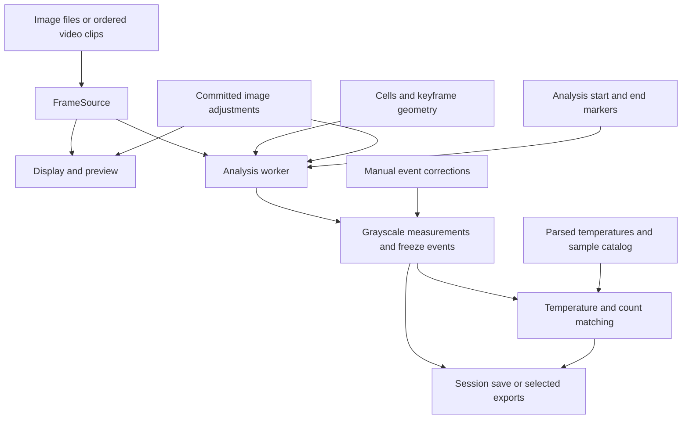

# Architecture Overview

This page explains where state lives and how a recording becomes results. Use the [Developer Guide](Developer-Guide.md) for setup and change workflows, and the [API Reference](API-Reference.md) for selected declarations and source links.

## The main window coordinates the application

[`IceScopy`](API-Class-IceScopy.md) is a Qt `QMainWindow`. It owns the active session: the frame source, current frame, cell geometry and records, sample catalog, image adjustments, result tables, and undo stack. Helper modules perform focused work, but controllers and mixins still read or update window attributes. A **mixin** supplies methods through inheritance; it is not an independent service.

[`IcescopyApplication`](API-Class-IcescopyApplication.md) handles operating-system file-open events and queues session paths until a window is available. [`main()`](../src/Icescopy.py) constructs the application and window. Package entry points are declared in [pyproject.toml](../pyproject.toml).

| Responsibility | Main code | State boundary |
| --- | --- | --- |
| Media acquisition | [Frame sources](API-Module-icescopy-frame-source.md), [video preview](API-Module-icescopy-video-preview.md) | A source provides frames; a preview worker has a separate decoder. |
| Cell identity and results | [Cell records](API-Module-icescopy-cell.md) | Cell IDs join geometry, sample assignments, and measurements. |
| Drawing and editing | [Controller](API-Module-icescopy-cell-controller.md), [scene items](API-Module-icescopy-cell-items.md) | A floating or pinned preview is not yet a saved edit. |
| Sample fields | [Metadata schema](API-Module-icescopy-sample-metadata.md), [catalog panel](API-Module-icescopy-sample-catalog.md) | Field definitions and sample values are separate. |
| Analysis | [Worker](API-Class-Image-analysis-thread.md), [freeze detection](API-Module-icescopy-freezfinder.md), [frame windows](API-Module-icescopy-analysis-windows.md) | The window installs completed worker results. |
| Temperature/count matching | [Parsers](API-Module-icescopy-temperature-import.md), [count builders](API-Module-icescopy-freeze-count-timeseries.md), [count refresh](API-Module-icescopy-temperature-refresh.md) | The import workflow joins parsed records to cell events. |
| Droplet detection | [Toolbar tools](API-Module-icescopy-droplet-tools.md), [neural detector](API-Module-icescopy-neural-detection.md), [random forest](API-Module-icescopy-droplet-detection.md), [training sessions](API-Module-icescopy-droplet-training-io.md) | Detection runs on a snapshot; results are checked against the current frame before insertion. |
| INP analysis | [Analysis window](API-Module-icescopy-inptk-panel.md), [choices](API-Module-icescopy-inptk-state.md), [input records](API-Module-icescopy-inptk-data.md), [toolkit client](API-Module-icescopy-inptk-client.md), [plots](API-Module-icescopy-inptk-plot.md), [CSV export](API-Module-icescopy-inptk-export.md) | Calculations run in the separately installed toolkit process. |
| Persistence and history | [Session I/O](API-Module-icescopy-session-io.md), [commands](API-Module-icescopy-session.md) | Saved bundles and in-memory undo history have different lifetimes. |

## From media to results

### Frames and identity

[`FrameSource`](API-Class-FrameSource.md) provides frame count, name, key, pixels, grayscale arrays, and optional timing. `ImageSequenceFrameSource` reads files; `VideoFrameSource` decodes one video with PyAV; `VideoSequenceFrameSource` combines clips and maps global indexes to clip/local indexes.

Use the source/window helpers. `imagePaths` is an image-sequence compatibility field and is empty for video; it is not the universal frame list. A **frame key** identifies a frame for caches and per-frame exposure offsets. A displayed filename is not a replacement for that key.

Preserve both index mappings when changing navigation: a filtered frame-list row can refer to a different source index, and a video sequence has global and clip-local indexes. Its `source_kind()` reports `video` to the UI, while its saved payload uses `video_sequence` to reconstruct the clips.

Video timing is not always obtained by decoding every timestamp. The [container-metadata path](../src/icescopy_frame_source.py#L345) can infer regular spacing from duration or average rate; the fallback [decode pass](../src/icescopy_frame_source.py#L401) reads frame timestamps. Do not claim exact timing for every variable-frame-rate file without checking the relevant path. Relative video time is also distinct from a wall-clock capture date.

### Geometry and image adjustments

Cell records hold identity, sample assignment, and results. Current and keyframe geometry hold centers and radii. The window interpolates geometry by cell ID between keyframes; [Cell System](Cell-System.md) describes the matching rules.

Committed image-edit state includes exposure, contrast, a reference area and per-frame offsets for uniform exposure, and a rotated crop. [Image adjustment helpers](API-Module-icescopy-image-edit.md) apply crop, exposure, then contrast to arrays. Display and measurement reuse these helpers. Crop preview state remains separate until Apply.

Cell image coordinates refer to the original frame. Display maps them through the crop transform and scene placement; the worker maps them into the cropped measurement array. Preserve the forward/inverse coordinate conversions when changing drawing behavior. A display-only fix must not silently move the measured region.

`apply_image_edit_state(..., invalidate_results=True)` can clear analysis after a committed change. The [invalidation methods](../src/Icescopy.py#L5317) also clear dependent temperature/count results and ask for reanalysis or reimport. Restore paths deliberately use different options so restoring saved results does not erase them.

### Analysis and results

`outputData()` captures previous result state, resolves inclusive analysis windows, prepares per-frame geometry, and starts [`Image_analysis_thread`](API-Class-Image-analysis-thread.md). **Inclusive** means both endpoint frames are analyzed. Each selected range is searched separately for freeze events. Missing measurements remain `nan`; finite stretches are processed separately so detection does not bridge gaps.

The worker builds grayscale rows for the whole source: frames outside selected ranges keep their position with missing values. Columns identify cells, for example `cell_3_grayscale`, alongside center and radius. Freeze rows identify cell, original source frame index, and frame name. The normal app path keeps results in memory; export is separate.

`analysis_done` is a per-frame progress signal. The window installs successful results in `onThreadFinished()`, synchronizes records/views, and adds history. Worker errors leave previous results available. Closing is blocked while analysis runs; the current worker has no general cancel API.

Temperature parsing is separate from detection. Import-specific builders combine event frames, sample groups, cycles, timing, and corrections. Manual freeze edits update cell events and invalidate dependent counts. Catalog metadata edits can refresh export metadata without recomputing detection. Keep these cases distinct.

## Saved state and undo history

The [bundle writer](../src/icescopy_session_io.py#L388) writes a ZIP containing `session.json` and populated result-table CSV members. JSON stores source references, geometry, sample schema/catalog, edit settings, markers, and related session state. Original media are not embedded. Image links can be relinked; that workflow does not cover video.

Loading reads the archive, migrates/prepares restore state, then applies it to the window. `migrate_session_payload()` supplies legacy defaults and rejects a newer unsupported schema. `open_session_file_path()` captures prior state and attempts rollback if restoration fails. Opening a session clears the undo stack; commands are not serialized into the bundle.

Saving serializes content, writes a sibling temporary archive, checks ZIP integrity, and replaces the destination. This protects an existing session against serialization failure, not every filesystem or external-media failure. Preference XML uses a similar temporary-write-and-validate path in [icescopy_paths](API-Module-icescopy-paths.md).

[Undo commands](API-Module-icescopy-session.md) restore focused before/after states through the window. The edit happens before its command is pushed, so each command skips Qt's first `redo()` call. Use matching capture/push/restore methods; do not repeat the original mutation in that first redo. `history_restoring` prevents restoration from creating new history.

## Workers, caches, and cleanup

Video preview runs in a separate Qt thread. Its worker creates a source from a preview payload and returns the frame index, image, key, and source token. The window checks source identity and the current target before applying results. The analysis worker reads the active source and does not update Qt result-table widgets directly.

The window caches raw/adjusted images and display pixmaps. Analysis caches circular-region descriptors and masks; plots cache prepared series. Video also uses a temporary PNG preview directory. Caching is therefore not entirely memory-only. Cache ownership and invalidation must follow source identity and committed edits.

[`set_frame_source()`](../src/Icescopy.py#L1908) and [`closeEvent()`](../src/Icescopy.py#L10972) explicitly stop preview decoding and close the old source. Audit other reset paths: `clear_session()` currently calls `initData()`, which directly resets source/decoder references. It should not be assumed to have the same cleanup sequence. Preview `close(timeout_ms=1000)` also performs a blocking worker call before its timed thread wait, so this is not a hard total shutdown deadline.

These are implementation boundaries to verify during related changes, not claims of complete lifecycle or timing coverage by the unit suite.
