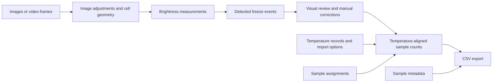

# Concepts and Data Flow

This page explains how the parts of an analysis relate. Follow [Quick Start](Quick-Start.md) for instructions; use this page to decide what an edit means or which result needs recalculating.

## From a recording to a count table

Each stage has a different purpose. A brightness change is not automatically a validated freeze event, and a count table is not automatically a concentration calculation.

## Frames and time

A **frame** is one image or one decoded video image in the loaded sequence. Numbering starts at **0**. A frame index is a position in the session, not a timestamp or a duration in seconds.

For images, the chosen order determines the sequence. For video, the frame source also supplies timing information. Temperature import must connect frames to the temperature logger's clock. Filename timestamps, modification times, generated intervals, and video timing are different information sources. Choosing one does not establish that the camera and logger clocks agree.

See [Loading and Reviewing Frames](Loading-and-Reviewing-Frames.md) and [Temperature Import](Temperature-Import.md) for ordering, time matching, and video-timing limitations.

## Cells and samples

A **cell** is a circular measurement region with a persistent Cell ID. Its center and radius determine which pixels contribute to brightness. It represents the selected part of a droplet or well, not an automatically recognized physical boundary.

A **sample** groups cells by Sample ID. Its name is an editable label. Moving cells between samples changes group counts without changing the brightness originally measured inside each circle.

**Metadata** is descriptive information such as a sample name, volume, or collection time. Entering it does not apply a physical conversion to the output. See [Sample Metadata](Sample-Metadata.md).

## Keyframes and analysis markers

A **keyframe** stores a cell layout at a particular frame. Icescopy interpolates positions and radii between saved layouts: it calculates intermediate values from surrounding saved values. This does not track a droplet by recognizing it in every image. Check intermediate frames as well as keyframes.

**Analysis start/end markers** choose which portions are measured and searched for freeze events. They do not crop source files and are independent of geometry keyframes. Both endpoints are included. Several pairs can select separate intervals; no markers means the whole recording. Read the [marker pairing rules](Analysis-and-Results.md#limit-analysis-with-start-and-end-markers) before using incomplete sets.

Changing the displayed frame does not itself mark a keyframe, define an analysis interval, or assign a freeze event.

## Brightness and freeze detection

The brightness series measures the mean value inside a cell circle. Image adjustments, crop, geometry, and the selected grayscale source can affect that measurement. **Grayscale** represents image brightness; video **luma** is a brightness channel provided by the video format when available.

Freeze finding transforms the series into a signal that emphasizes changes, then searches it for peaks. The dashed plot line is a processed detection signal, not another brightness measurement. Peak prominence and width describe this signal; they are not temperature thresholds or universal physical properties of freezing.

A detected frame is a candidate to review against the visible droplet. Motion, lighting changes, and an incorrect circle can also cause brightness changes. Check representative clear, weak, and non-freezing cells when tuning. See [Analysis and Results](Analysis-and-Results.md).

## Current frame, freeze frame, and manual corrections

The current-frame marker shows the frame you are viewing. A freeze marker shows an event assigned to a selected cell. Those lines coincide only when you view that event's frame; they normally separate while you navigate elsewhere.

Manual corrections change events after visual review. A later automatic analysis run replaces events with new detections. Finish tuning and rerunning before final manual corrections, or save separate sessions to retain both versions.

## Temperature and repeated cycles

Temperature import combines reviewed events, sample assignments, timing, and importer-specific choices. Repeated-cycle settings determine when a warming stage resets the count for another cooling cycle. All included samples, including blanks, keep their own total and frozen counts. Apply blank correction in downstream analysis after reviewing the recording and import summary.

Read [Temperature Import](Temperature-Import.md) for matching and reset rules, and [Output Reference](Output-Reference.md) for the meaning of exported counts.

## What to repeat after an edit

This table explains how to produce a consistent new result. It does not mean every edit automatically runs the listed steps.

| You changed | What to do next |
| --- | --- |
| Loaded frames, order, or video clips | Verify order and annotation alignment; rerun analysis and reimport temperatures |
| Circle geometry, keyframes, crop, exposure, contrast, or illumination correction | Inspect affected frames; rerun analysis, review events, and reimport temperatures |
| Analysis start/end markers | Check intervals; rerun analysis, review events, and reimport temperatures |
| Brightness source or freeze-finding preferences | Rerun and review before reimporting temperatures |
| A freeze event manually | Reimport temperatures and export again; do not rerun automatic detection if you want to retain the correction |
| Cells' Sample IDs | Reimport temperatures to rebuild group counts, then export again |
| Temperature input, timing, calibration, or cycle options | Reimport temperatures, inspect the table, and export again |
| Sample names or descriptive metadata | Save and export again; brightness measurement need not repeat |
| Zoom, visible comparison frames, panel layout, annotation colors, or plot styling | No rerun is needed for appearance alone |

## Reproduce or share a result

Keep source media, temperature records, the reviewed session, exports, app version, and a record of detection settings and import choices. A session stores important state and results but **not all global Preferences** or the source files themselves.

Save versions before changing the analysis method, after freeze review, and after final temperature import. Use new export folders for alternatives. See [what a session saves](Sessions-Export-and-Preferences.md#what-is-saved).

## Terms at a glance

| Term | Meaning here |
| --- | --- |
| Cell / region of interest | Circular area whose pixels are measured |
| Frame index | Position in the loaded sequence, starting at 0 |
| Keyframe | Frame with a saved cell layout |
| Analysis interval | Inclusive range selected for automatic analysis |
| Freeze event | Frame assigned as a cell's freezing event |
| Sample ID | Identity of a group of cells |
| Time series | Values ordered by time or frame |
| CSV | Comma-separated text table |
| `nan` | Missing value; interpret it according to its column |
| Session | Saved working state in a `.icescopy` file |

Related: [Quick Start](Quick-Start.md) · [Analysis and Results](Analysis-and-Results.md) · [Output Reference](Output-Reference.md)
